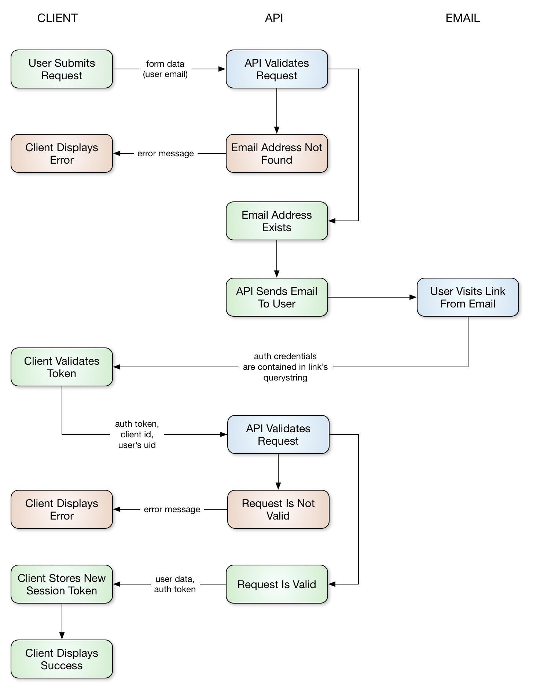

## FAQ

### Can I use this gem alongside standard Devise?

Yes! But you will need to enable the support of separate routes for standard Devise. So do something like this:

#### config/initializers/devise_token_auth.rb
~~~ruby
DeviseTokenAuth.setup do |config|
  config.enable_standard_devise_support = true
end
~~~

#### config/routes.rb
~~~ruby
Rails.application.routes.draw do

  # standard devise routes available at /users
  # NOTE: make sure this comes first!!!
  devise_for :users

  # token auth routes available at /api/v1/auth
  namespace :api do
    scope :v1 do
      mount_devise_token_auth_for 'User', at: 'auth'
    end
  end

end
~~~

### Another method for using this gem alongside standard Devise (updated May 2018)

Some users have been experiencing issues with using this gem alongside standard Devise, with the `config.enable_standard_devise_support = true` method.

Another method suggested by [jotolo](https://github.com/jotolo) is to have separate child `application_controller.rb` files that use either DeviseTokenAuth or standard Devise, which all inherit from a base `application_controller.rb` file. For example, you could have an `api/v1/application_controller.rb` file for the API of your app (which would use Devise Token Auth), and a `admin/application_controller.rb` file for the full stack part of your app (using standard Devise). The idea is to redirect each flow in your application to the appropriate child `application_controller.rb` file. Example code below:

#### controllers/api/v1/application_controller.rb
Child application controller for your API, using DeviseTokenAuth.
~~~ruby
module Api
  module V1
    class ApplicationController < ::ApplicationController
      skip_before_action :verify_authenticity_token
      include DeviseTokenAuth::Concerns::SetUserByToken
    end
  end
end
~~~

#### controllers/admin/application_controller.rb
Child application controller for full stack section, using standard Devise.
~~~ruby
module Admin
  class ApplicationController < ::ApplicationController
    before_action :authenticate_admin!
  end
end
~~~

#### controllers/application_controller.rb
The base application controller file. If you're using CSRF token protection, you can skip it in the API specific application controller (`api/v1/application_controller.rb`).
~~~ruby
class ApplicationController < ActionController::Base
  protect_from_forgery with: :exception
end
~~~

#### config/initializers/devise_token_auth.rb
Keep the `enable_standard_devise_support` configuration commented out or set to `false`.
~~~ruby
# config.enable_standard_devise_support = false
~~~

### Why are the `new` routes included if this gem doesn't use them?

Removing the `new` routes will require significant modifications to devise. If the inclusion of the `new` routes is causing your app any problems, post an issue in the issue tracker and it will be addressed ASAP.

### I'm having trouble using this gem alongside [ActiveAdmin](https://activeadmin.info/)...

For some odd reason, [ActiveAdmin](https://activeadmin.info/) extends from your own app's `ApplicationController`. This becomes a problem if you include the `DeviseTokenAuth::Concerns::SetUserByToken` concern in your app's `ApplicationController`.

The solution is to use two separate `ApplicationController` classes - one for your API, and one for ActiveAdmin. Something like this:

~~~ruby
# app/controllers/api_controller.rb
# API routes extend from this controller
class ApiController < ActionController::Base
  include DeviseTokenAuth::Concerns::SetUserByToken
end

# app/controllers/application_controller.rb
# leave this for ActiveAdmin, and any other non-api routes
class ApplicationController < ActionController::Base
end
~~~


### How can I use this gem with Grape?

You may be interested in [GrapeTokenAuth](https://github.com/mcordell/grape_token_auth) or [GrapeDeviseTokenAuth](https://github.com/mcordell/grape_devise_token_auth).

### What's the reset password flow?

This is the overall workflow for a User to reset their password:

- user goes to a page on the front end site which contains a form with a single text field, they type their email address into this field and click a button to submit the form

- that form submission sends a request to the API: `POST /auth/password` with some parameters: `email` (the email supplied in the field) & `redirect_url` (a page in the front end site that will contain a form with `password` and `password_confirmation` fields)

- the API responds to this request by generating a `reset_password_token` and sending an email (the `reset_password_instructions.html.erb` file from devise) to the email address provided within the `email` parameter
  - we need to modify the `reset_password_instructions.html.erb` file to point to the API: `GET /auth/password/edit`
  - for example, if you have your API under the `api/v1` namespaces: `<%= link_to 'Change my password', edit_api_v1_user_password_url(reset_password_token: @token, config: message['client-config'].to_s, redirect_url: message['redirect-url'].to_s) %>` (I came up with this `link_to` by referring to [this line](https://github.com/lynndylanhurley/devise_token_auth/blob/15bf7857eca2d33602c7a9cb9d08db8a160f8ab8/app/views/devise/mailer/reset_password_instructions.html.erb#L5))

- the user clicks the link in the email, which brings them to the 'Verify user by password reset token' endpoint (`GET /password/edit`)

- this endpoint verifies the user and redirects them to the `redirect_url` (or the one you set in an initializer as default_password_reset_url) with the auth headers if they are who they claim to be (if their `reset_password_token` matches a User record)

- this `redirect_url` is a page on the frontend which contains a `password` and `password_confirmation` field

- the user submits the form on this frontend page, which sends a request to API: `PUT /auth/password` with the `password` and `password_confirmation` parameters. In addition headers need to be included from the url params (you get these from the url as query params). A side note, ensure that the header names follow the convention outlined in `config/initializers/devise_token_auth.rb`; at this time of writing it is: `uid`, `client` and `access-token`.
  - _Ensure that the `uid` sent in the headers is not URL-escaped. e.g. it should be bob@example.com, not bob%40example.com_

- the API changes the user's password and responds back with a success message

- the front end needs to manually redirect the user to its login page after receiving this success response

- the user logs in

The next diagram shows how it works:



If you get in any trouble configuring or overriding the behavior, you can check the [issue #604](https://github.com/lynndylanhurley/devise_token_auth/issues/604).


### I already have a user, how can I add the new fields?

1. First, remove the migration generated by the following command`rails g devise_token_auth:install [USER_CLASS] [MOUNT_PATH]` and then:.
2. Create another fresh migration:

```ruby

  # create migration by running a command like this (where `User` is your USER_CLASS table):
  # `rails g migration AddTokensToUsers provider:string uid:string tokens:text`

  def up
    add_column :users, :provider, :string, null: false, default: 'email'
    add_column :users, :uid, :string, null: false, default: ''
    add_column :users, :tokens, :text

    # if your existing User model does not have an existing **encrypted_password** column uncomment below line.
    # add_column :users, :encrypted_password, :null => false, :default => ""

    # the following will update your models so that when you run your migration

    # updates the user table immediately with the above defaults
    User.reset_column_information

    # finds all existing users and updates them.
    # if you change the default values above you'll also have to change them here below:
    User.find_each do |user|
      user.uid = user.email
      user.provider = 'email'
      user.save!
    end

    # to speed up lookups to these columns:
    add_index :users, [:uid, :provider], unique: true
  end

  def down
    # if you added **encrypted_password** above, add here to successfully rollback
    remove_columns :users, :provider, :uid, :tokens
  end

```
